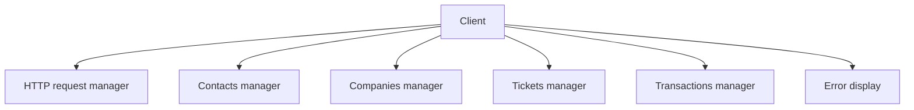
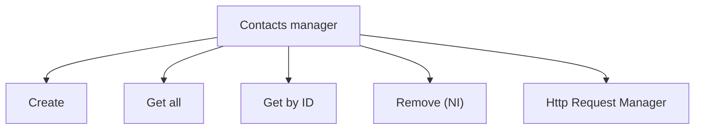
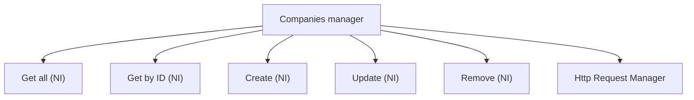
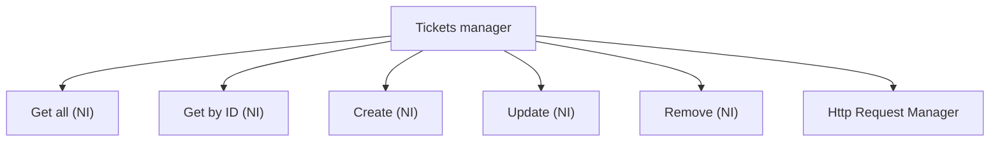

# [HubSpot API](https://developers.hubspot.com/docs/api/overview) Client

A TypeScript client to communicate with HubSpot API.

<br>

## Setup
Install <ins>nodejs</ins> and <ins>ts-node</ins> with your package manager (pacman, apt, dnf etc..).

## Run
```bash
ts-node Example.ts
```

## Architecture


`Client` is the main class and encapsulates multiple managers related to multiple HubSpot APIs (contacts, companies etc..).  
Aside, there is HTTP request manager which sends the API key in the request, removing this burden from the endpoints.  
Then, `Client` has a class to display errors thrown by the request (only formatting its message to make it clearer on a terminal, in a real application one might not use it).  
>Please note that only TypeScript errors are supported for now (as they're JSON-formatted), things like 404 not found are HTML pages and need different parsing.  

The architecture represents a complete project, most of the features aren't implemented (they're marked with <ins>NI</ins> -> <b>Not Implemented</b>).
The main point here is how is the code organized rather than rushing features and ending with an unmaintable and duplicated code.

<hr style="border:0px solid gray">



<hr style="border:0px solid gray">



<hr style="border:0px solid gray">



<hr style="border:0px solid gray">


<hr style="border:0px solid gray">

Each of these 4 subclasses aims to manage one kind of API provided by HubSpot, to separate tasks.  
They provide some services by sending HTTP requests to HubSpot APIs.
The `Client` class has a member of type `HttpRequestManager`, which is used by subclasses and their services.  
It permits services delegating the request to a specific class whose unique job is this, following **SRP** (Single Responsibility Principle) in SOLID.

## Hooks
<ul>
<li><code>prepare-commit-msg</code> checks if the commit message is like <code>[TYPE] : Message</code>, to have clear commit names and instantly understand what's going on.</li>
<li><code>pre-commit</code> checks if there's nothing inside any file which matches with HubSpot API key pattern. It also check filenames themselves (including directories).