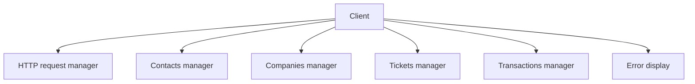
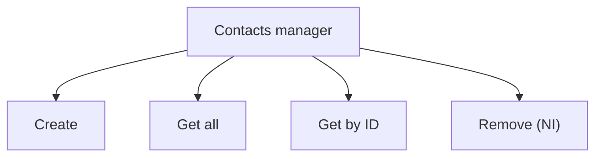
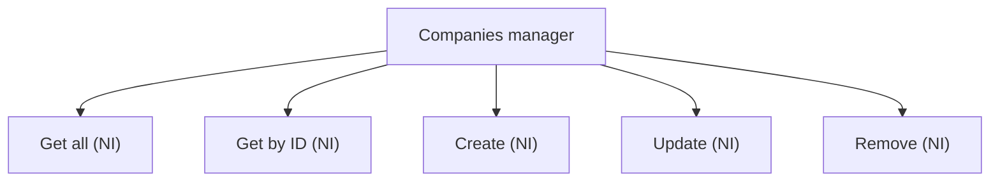
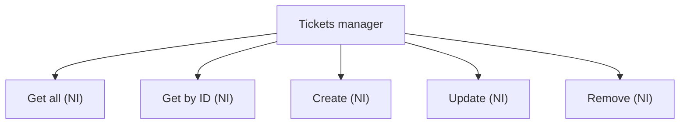
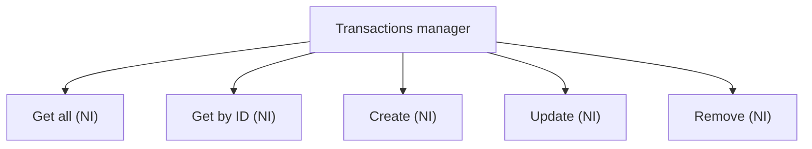

# [HubSpot API](https://developers.hubspot.com/docs/api/overview) Client

A TypeScript client to communicate with HubSpot API.

<br>

## Setup
Install <ins>nodejs</ins> and <ins>ts-node</ins> with your package manager (pacman, apt, dnf etc..).

## Run
```bash
ts-node Example.ts
```

## Architecture


Note: <ins>NI</ins> = **Not Implemented**







## Hooks
<ul>
<li><code>prepare-commit-msg</code> checks if the commit message is like <code>[TYPE] : Message</code>, to have clear commit names and instantly understand what's going on.</li>
<li><code>pre-commit</code> checks if there's nothing inside any file which matches with HubSpot API key pattern. It also check filenames themselves (including directories).