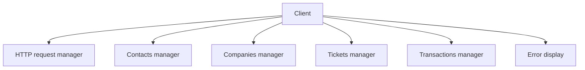
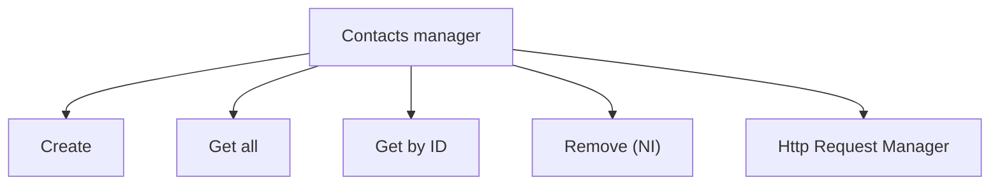
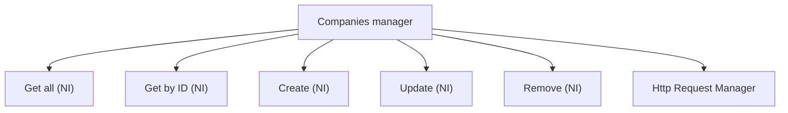
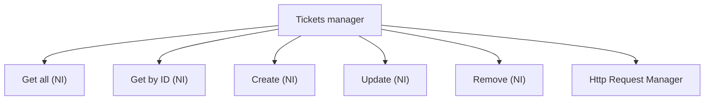

# [HubSpot API](https://developers.hubspot.com/docs/api/overview) Client

A TypeScript client to communicate with HubSpot API.

My first ever project in TypeScript and web languages in general, I worked on it for 2 days (commit date on GitHub isn't accurate because I rebased the repo, use git log instead).  
As I haven't yet much knowledge about good practices in web or even in TypeScript, I choose to imlement just a few features and focus on the architecture, as a good organization is way more complicated than a single feature.  
Therefore, a new feature can easily be added to the project.  

<hr style="border:0px solid gray">

Please take a look on the GitHub issues, a friend of mine works in full-stack development and reviewed my code.  
His point of view helped me a lot to think about ways to improve my work, especially about scalability.  
He gave me confidence in most of my choices and said my code is globally okay, but he  took time to share his experience with me to enhance it.  

<hr style="border:0px solid gray">

## Git workflow

As the project is quite small for now, and because of my lack of experience in the language, it took me some time to understand the direction to take.  
That's why I didn't create any branch like I usually do, but I created a dev one to solve one of my friend's issues, then merged it into master when closed.  

## Setup
Install <ins>nodejs</ins> and <ins>ts-node</ins> with your package manager (pacman, apt, dnf etc..).

## Run
```bash
ts-node Example.ts
```

Example.ts is only here to show how to use my client, it has nothing to do in a real-world app. Same for Client.PrintError, its interest is quite limited in a website with a backend client, I made it to test my features with Example.ts and format errors in a more human-readable way.  

I didn't use env variable in GitHub to store API key (my friend created an issue about that) because I hadn't much time for so much to learn.  
Nevertheless, I added strong checks to make sure API key isn't pushed (see in Hooks section below).  

## Architecture


`Client` is the main class and encapsulates multiple managers related to multiple HubSpot APIs (contacts, companies etc..).  
Aside, there is HTTP request manager which sends the API key in the request, removing this burden from the endpoints.  
Then, `Client` has a class to display errors thrown by the request (only formatting its message to make it clearer on a terminal, in a real application one might not use it).  
>Please note that only TypeScript errors are supported for now (as they're JSON-formatted), things like 404 not found are HTML pages and need different parsing.  

The architecture represents a complete project, most of the features aren't implemented (they're marked with <ins>NI</ins> -> <b>Not Implemented</b>).
The main point here is how is the code organized rather than rushing features and ending with an unmaintable and duplicated code.

<hr style="border:0px solid gray">



<hr style="border:0px solid gray">



<hr style="border:0px solid gray">



<hr style="border:0px solid gray">


<hr style="border:0px solid gray">

Each of these 4 subclasses aims to manage one kind of API provided by HubSpot, to separate tasks.  
They provide some services by sending HTTP requests to HubSpot APIs.
The `Client` class has a member of type `Api`, which is used by subclasses and their services.  
It permits services delegating the request to a specific class whose unique job is this, following **SRP** (Single Responsibility Principle) in SOLID.

## Hooks
<ul>
<li><code>prepare-commit-msg</code> checks if the commit message is like <code>[TYPE] : Message</code>, to have clear commit names and instantly understand what's going on.</li>
<li><code>pre-commit</code> checks if there's nothing inside any file which matches with HubSpot API key pattern. It also check filenames themselves (including directories).