# [HubSpot API](https://developers.hubspot.com/docs/api/overview) Client
### In TypeScript

<br>

## Setup
Install <ins>nodejs</ins> and <ins>ts-node</ins> with your package manager (pacman, apt, dnf etc..).

## Run
```bash
ts-node Example.ts
```

## Architecture

```mermaid
graph TD;
    A[Client] --> B[HTTP request manager];
    A --> C[Contacts manager];
    A --> D[Companies manager];
    A --> E[Tickets manager];
    A --> F[Transactions manager];
    A --> G[Error display];
    C --> H[Create];
    C --> I[Get all];
    C --> J[Get by ID];
    C --> K["Remove (NI)"];
    D --> L["Get all (NI)"];
    D --> M["Get by ID (NI)"];
    D --> N["Create (NI)"];
    D --> O["Update (NI)"];
    D --> P["Remove (NI)"];
    E --> Q["Get all (NI)"];
    E --> R["Get by ID (NI)"];
    E --> S["Create (NI)"];
    E --> T["Update (NI)"];
    E --> U["Remove (NI)"];
    F --> V["Get all (NI)"];
    F --> W["Get by ID (NI)"];
    F --> X["Create (NI)"];
    F --> Y["Update (NI)"];
    F --> Z["Remove (NI)"];
```

Note: <ins>NI</ins> = **Not Implemented**